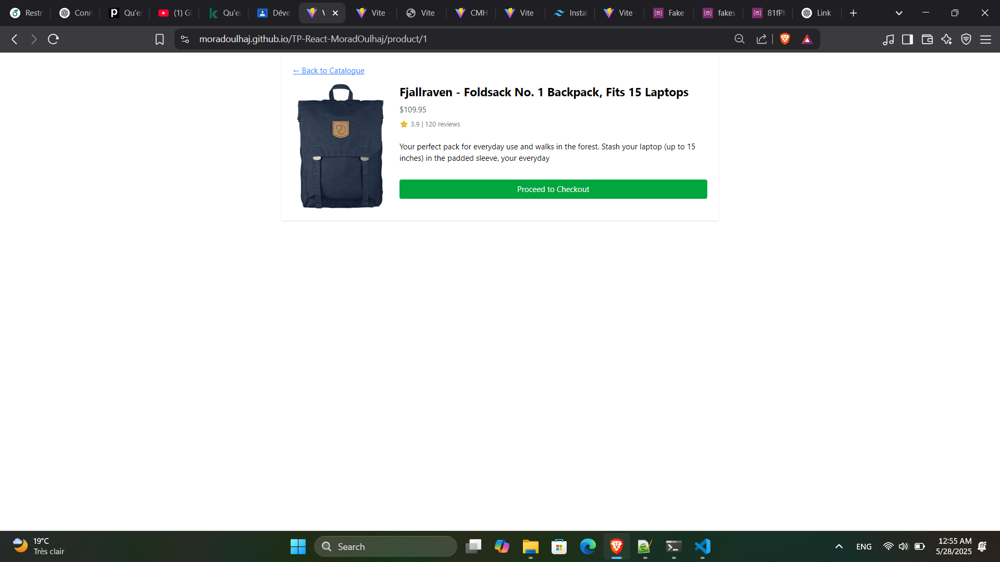

# 🛒 React Product Catalogue App

**Live Demo**: [[https://moradoulhaj.github.io/tp-react-moradoulhaj](https://moradoulhaj.github.io/TP-React-MoradOulhaj)]

A responsive e-commerce frontend built with **React + TypeScript**, styled with **Tailwind CSS**, featuring search, category filters, product detail views, login authentication, and checkout — powered by [Fake Store API](https://fakestoreapi.com/). Hosted on **GitHub Pages**.

---

## 🚀 Features

- 🗂 Product listing with filtering and search  
- 🔍 Dynamic product details view  
- 🔐 User login using API authentication  
- 💳 Checkout screen  
- 🌐 Deployed on GitHub Pages

---

## 📦 Tech Stack

- **React 18**
- **TypeScript**
- **Tailwind CSS**
- **React Router DOM v6**
- **gh-pages** – GitHub Pages deployment
- **Fake Store API** – for products and login

---

## 📸 Screenshots


- **Catalogue Page**  
  

- **Search & Filter**  
  
  
- **Product Details**  
  

- **Login Page**  
  


---

## 🛠️ Getting Started

### 1. Clone the repo

```bash
git clone https://github.com/moradoulhaj/tp-react-moradoulhaj.git
cd tp-react-moradoulhaj
```
### 2. Install dependencies

```bash
npm install
```
### 2. Start Server

```bash
npm run dev
```
